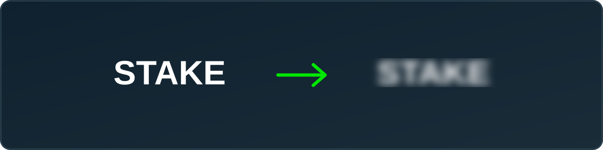

<!--
  Keywords: stake censor, stake logo blur, censor stake, hide stake branding,
  stake.com userscript, tampermonkey stake, stream safe gambling, youtube tos
  gambling, twitch gambling ban, blur casino logo, stake us censor, content
  creator gambling overlay, stake blur extension, stake logo remover
-->

<p align="center">
  
</p>

<h1 align="center">Stake Censor — Blur Every Stake Logo & Branding</h1>

<p align="center">
  <strong>A free Tampermonkey userscript that automatically blurs all Stake logos, badges, and branding across <code>stake.com</code>, <code>stake.us</code>, <code>stake.bet</code> and <code>stake.games</code> — with a one-click on/off toggle.</strong>
</p>

<p align="center">
  
  
  
  
  <a href="https://www.virustotal.com/gui/file/cb97f0f87c00ec6441f7804b5337aafd3a46ac2e8d26dd800b48a5d37862fbfd/detection"></a>
</p>

---

## 🎥 Who this is for — content creators & streamers

This script is built **mainly for content creators, streamers, and YouTubers.**

Most major platforms restrict or demonetize unlicensed gambling content. **[YouTube's policy](https://support.google.com/youtube/answer/9229611)** can age-restrict, demonetize, or remove videos that **show gambling-site branding or link to sites that aren't certified**, and **Twitch** bans streaming a number of gambling sites outright. If you record or stream gameplay on Stake, leaving the logo on screen can put your channel at risk.

**Stake Censor blurs every visible "Stake" logo and mention in real time**, so your capture stays clean without you editing each frame by hand. Flip it **off** instantly when you're off-camera.

> ⚠️ This is a visual aid, not legal advice. You are still responsible for following the Terms of Service of YouTube, Twitch, or any platform you post to. Always check the current rules yourself.

---

## ✨ Features

- **Blurs everything Stake-branded:** header/nav logos, "Stake Originals" & "Stake Exclusive" badges, the animated "Only on Stake" footer logo, game-tile provider badges, in-game footer logos, loading/splash screens, and certification/license images.
- **Censors the word "Stake" in text** — titles, headings, and badges — while leaving your **balance and bet amounts untouched**.
- **Keeps the site usable:** game controls (fullscreen, stats, fairness, dropdowns) and sidebar game icons stay sharp.
- **One-click toggle** built into the page to turn censoring on/off.
- **No flash of branding:** CSS is injected before first paint.
- **Works with the SPA:** handles Stake's SvelteKit client-side navigation without blanking the page.

> ⚠️ **Heads-up:** tested mostly on **stake.com**. It may still miss elements or have bugs on other Stake domains or newer layouts. [Open an issue](../../issues) if you spot something.

---

## 📦 Installation

### 1. Install Tampermonkey

Tampermonkey is a free browser extension that runs userscripts:

| Browser | Install link |
|---|---|
| **Chrome** | https://chrome.google.com/webstore/detail/tampermonkey/dhdgffkkebhmkfjojejmpbldmpobfkfo |
| **Edge** | https://microsoftedge.microsoft.com/addons/detail/tampermonkey/iikmkjmpaadaobahmlepeloendndfphd |
| **Firefox** | https://addons.mozilla.org/firefox/addon/tampermonkey/ |
| **Safari** | https://apps.apple.com/app/tampermonkey/id1482490089 |
| **Opera** | https://addons.opera.com/extensions/details/tampermonkey-beta/ |

After installing you'll see the Tampermonkey icon in your toolbar. Newer Chrome/Edge versions require **Developer mode** to be enabled on the extensions page — Tampermonkey will prompt you if needed.

### 2. Add the script

**One-click (recommended):**

👉 **[Click here to install `stake-censor.user.js`](../../raw/main/stake-censor.user.js)**

Tampermonkey detects the `.user.js` file and opens its install page — click **Install**.

**Manual:**

1. Tampermonkey icon → **Create a new script…**
2. Delete the template code.
3. Paste the contents of [`stake-censor.user.js`](stake-censor.user.js).
4. **Ctrl + S** to save.

### 3. Done

Open or refresh any Stake page — branding is blurred automatically.

---

## 🔘 The toggle button (turn censoring ON / OFF)

The script adds a small **eye button** into the page, right next to Stake's **support / live-chat button** in the **bottom-right corner** of the site.

| State | Looks like | Meaning |
|---|---|---|
| **ON** | 🟢 green eye-with-slash icon | branding is blurred |
| **OFF** | ⚪ grey open-eye icon | original site shown |

Click it to toggle. Hover for a **"Censor ON / Censor OFF"** tooltip.

> If you don't see the button, it only appears once Stake's support widget has loaded — give the page a second. It re-positions itself automatically.

---

## 💖 Donate

If this saved your channel (or your eyes), tips are appreciated 🙏

| Coin | Address |
|---|---|
| **BTC** (Bitcoin) | `bc1qwvn59c0yrhc9xwd9x9hrgwm4exe84xx0tdazdv` |
| **USDT** (ERC-20) | `0x2871854E89Cf7D070e8d569A407B6432Da7F0dF5` |
| **USDC** (ERC-20) | `0x2871854E89Cf7D070e8d569A407B6432Da7F0dF5` |

---

## ❓ FAQ

**Does this work on Twitch/YouTube directly?**
No — it censors the **Stake website** in your browser (what your capture software records). It doesn't touch already-recorded video.

**Will it hide my balance?**
No. Money/balance/amount fields are deliberately excluded.

**It missed a logo / blurred something it shouldn't.**
Layouts change. [Open an issue](../../issues) with the page and a screenshot.

---

## 🛡️ Security

Userscripts run on the page, so you should only install ones you can read. This script is a single, unobfuscated file you can review top to bottom — it only touches the DOM to blur branding and adds the toggle button. No network requests, no data collection.

Independent scan:

- **VirusTotal report:** https://www.virustotal.com/gui/file/cb97f0f87c00ec6441f7804b5337aafd3a46ac2e8d26dd800b48a5d37862fbfd/detection
- **SHA-256:** `cb97f0f87c00ec6441f7804b5337aafd3a46ac2e8d26dd800b48a5d37862fbfd`

Verify the file you downloaded matches:

```powershell
# Windows (PowerShell)
Get-FileHash .\stake-censor.user.js -Algorithm SHA256
```
```bash
# macOS / Linux
shasum -a 256 stake-censor.user.js
```

---

## 📄 License

[MIT](LICENSE) © NyxiYT

<sub>Tags: stake censor · blur stake logo · hide stake branding · stake.com userscript · tampermonkey gambling · stream-safe casino · youtube tos gambling · twitch gambling · content creator overlay · stake.us</sub>
